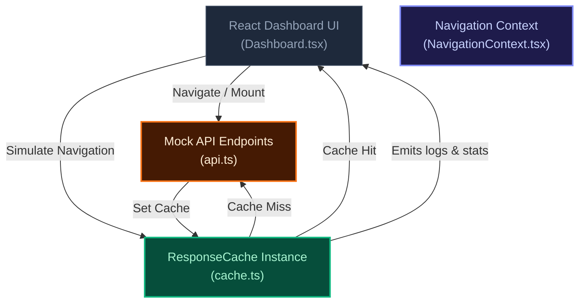

# Sanket Saas — Real-Time API Caching Simulator & Telemetry Dashboard

[](https://react.dev/)
[](https://vitejs.dev/)
[](https://www.typescriptlang.org/)
[](https://tailwindcss.com/)
[](https://github.com/reticlehq/reticle)
[](https://opensource.org/licenses/MIT)

An interactive, responsive SaaS dashboard simulator featuring a custom in-memory API Caching layer, live simulated telemetry log console, latency savings calculator, and fully instrumented with **Reticle** for autonomous agentic verification.

---

## 1. System Overview & Problem Statement

In web development, excessive API requests to database or microservices backends introduce substantial round-trip latency, inflate hosting costs, and degrade the user experience. Implementing smart caching strategies reduces unnecessary data fetching.

**Sanket Saas** features a simulator to demonstrate the performance benefits of a local caching engine:

1. **Custom Caching Engine**: An in-memory key-value caching system (`ResponseCache`) with custom Time-To-Live (TTL) expiration rules (configured to 60s).
2. **Parallel Endpoint Simulation**: Simultaneously queries 4 mock REST endpoints (`metric_overview`, `traffic_sources`, `conversion_funnel`, `user_events`) simulating network round-trips with randomized database response values.
3. **Live Telemetry Logger**: Renders cache hits, misses, writes, and expirations live in a custom terminal log window with appropriate color coding and timestamping.
4. **Interactive Cache Controls**: Allows simulating tab navigation (using cache), forcing cache bypass reload, and clearing/wiping memory cache.
5. **Reticle Instrumentation**: Wires the Reticle dev-only verification SDK directly into the Vite build pipeline, enabling developers and AI agents to execute runtime verification of cache hits, misses, and navigation flows.

---

## 2. Key Engineering Highlights

- **Custom Cache Engine (`cache.ts`)**: Implements `get<T>`, `set<T>`, and `clear()` methods on an ES6 `Map` wrapper with reactive updates via callbacks.
- **Latency Savings Estimation**: Assumes a 500ms server round-trip latency savings per local cache hit and aggregates metrics in real time.
- **Vibrant Dark-Mode Terminal UI**: Custom log console supporting log-level highlighting (`hit` in green, `miss` in yellow, `expire` in red, `set` in blue) with smooth hover micro-animations.
- **Vite Integration**: Equipped with `@reticlehq/vite-plugin` to stamp source elements with `data-reticle-source` pointers, supporting direct DOM node trace maps in development.

---

## 3. Architecture & Data Flow



---

## 4. Repository Structure

```text
Reticle/
├── .cursor/
│   ├── commands/
│   │   └── reticle.md        # Cursor Reticle verify shortcut command
│   └── rules/
│       └── reticle.mdc       # Reticle verification rules for Cursor
├── public/                   # Static browser assets
├── src/
│   ├── assets/               # Local styling and images
│   ├── components/
│   │   ├── Dashboard/
│   │   │   ├── Dashboard.tsx # Main dashboard layout, stats, and terminal console
│   │   │   ├── api.ts        # Mock REST API simulation
│   │   │   └── cache.ts      # Custom ResponseCache engine class
│   │   ├── Brands.tsx
│   │   ├── Comparison.tsx
│   │   ├── CoolFeatures.tsx
│   │   ├── Cta.tsx
│   │   ├── FeatureDetails.tsx
│   │   ├── FeaturesTop.tsx
│   │   ├── Footer.tsx
│   │   ├── Hero.tsx
│   │   ├── Navbar.tsx
│   │   ├── PreLoader.tsx
│   │   └── Testimonial.tsx
│   ├── constants/            # Application static constants
│   ├── context/
│   │   └── NavigationContext.tsx # View router state provider
│   ├── App.css
│   ├── App.tsx               # Main application component routing
│   ├── main.tsx              # React client DOM entry point
│   ├── reticle-dev.ts        # Scaffolding for Reticle capability registration
│   └── vite-env.d.ts
├── .eslintrc.cjs
├── .gitignore
├── .reticle.json             # Reticle configuration manifest
├── AGENTS.md                 # Agent-facing Reticle guidelines
├── index.html
├── package.json
├── RETICLE.md                # Comprehensive Reticle reference rules
├── tailwind.config.js
├── tsconfig.json
└── vite.config.ts            # Vite configuration with Reticle plugin
```

---

## 5. Local Setup, Execution & Testing

### 1. Installation
Clone the repository and install Node.js dependencies:

```bash
npm install
```

### 2. Start the Development Server
Run the local Vite bundler:

```bash
npm run dev
```
The server will boot on http://localhost:5173/ (or fallback to http://localhost:5174/ if busy).

### 3. Build for Production
To compile the application bundle:

```bash
npm run build
```

---

## 6. Reticle Verification Pipeline

This application is instrumented by **Reticle**, allowing automated and manual runtime checks inside the browser.

To run a verification sequence using Reticle MCP tools:

1. **Verify Session Connection**:
   Check if the app is connected to the Reticle daemon:
   ```bash
   npx @reticlehq/server status
   ```
2. **Execute Headless Verification**:
   The verification checks the following flows on http://localhost:5173:
   - Landing-to-dashboard navigation.
   - Initial 4 cache misses (yellow console logs).
   - 4 cache hits (green console logs) upon simulating tab navigation within 60s.
